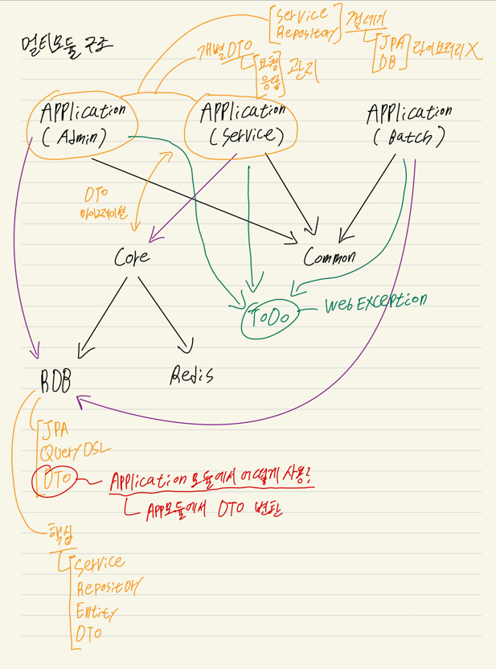

# 최신사 토이프로젝트
- [프로젝트 전반적인 설정 및 이슈 관리 - 노션](https://candied-turner-915.notion.site/ChoiSinSa-c77c2469974845e2b9c7dcca11717772)
- [프로젝트 세부 사항 기획 및 정책 정리 - 피그마](https://www.figma.com/file/UbMVszmu3byhrEBEYfqhxm/ChoiSinsa?type=design&node-id=0-1&mode=design&t=S4Psf7cU2G2pWCim-0)
- [RDBMS ERD - dbdiagram](https://dbdiagram.io/d/6309f8a7f1a9b01b0ff374bd)

## 프로젝트 설정
- java - openjdk16
- spring boot - 2.7.2
- gradle - 7.5
- jpa & querydsl
- mysql - 8.0.30

## 프로젝트 설명
- 무신사 사이트 클론 토이프로젝트
- 멀티 모듈 구조

## 멀티 모듈 구조 의존 방향

[멀티 모듈](file:./markdown/multi-module-structure.png)
